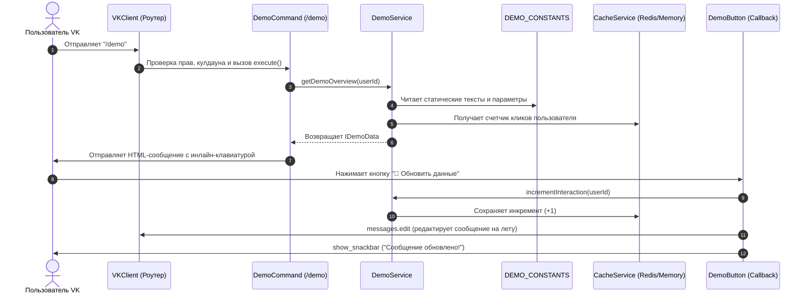

# 🤖 VK Bot Starter & Architecture Shell

> **Масштабируемая, модульная архитектурная оболочка для создания высоконагруженных и расширяемых ботов ВКонтакте на TypeScript и `vk-io`.**

Готовый к использованию стартовый шаблон (Starter Kit). Скачивайте, указывайте токен группы в `.env` и запускайте — весь базовый каркас, динамическая загрузка модулей, система прав, кэширование и интерактивные кнопки уже настроены.

---

## 💡 Философия архитектуры: Зачем такая структура?

> [!NOTE]
> **Важное замечание о масштабе проекта:**  
> Если ваша задача — сделать простого бота на 1-2 команды (например, ответить «Привет» на «Привет»), эта структура может показаться избыточной и сложной. Для примитивных ботов достаточно одного скрипта.
>
> **Эта оболочка создана для средних и крупных систем:** ботов с десятками команд, многоуровневыми интерактивными меню, правами доступа (пользователи, модераторы, администраторы, разработчики), фоновыми задачами (Cron), внешними интеграциями и базами данных.

### Преимущества многоуровневой архитектуры (Layered Architecture):
1. **Разделение ответственности (Separation of Concerns):**
   - **Команды (`commands/`)** отвечают исключительно за прием команды и отправку ответа пользователю.
   - **Кнопки (`buttons/`)** изолированно обрабатывают нажатия Callback/Inline-кнопок.
   - **Сервисы (`services/`)** содержат чистую бизнес-логику (расчеты, запросы к БД/API) и не зависят от интерфейса VK.
   - **Константы (`constants/`)** хранят тексты, системные цвета и настройки.
2. **Динамическая автозагрузка (Plugin-like loading):**
   Чтобы добавить новую команду или кнопку, достаточно создать файл в соответствующей папке. Никаких ручных импортов в `index.ts`.
3. **Горячая перезагрузка (Hot-Reload):**
   Разработчики могут обновить код команд и кнопок прямо на работающем сервере с помощью команды `/reload` без перезапуска Node.js.
4. **Автономность запуска (Out-of-the-box):**
   Бот снабжен встроенным *in-memory fallback*: если MySQL или Redis временно отключены или не настроены, бот **не упадет**, а продолжит стабильную работу.

---

## 📁 Структура проекта

```text
├── src/
│   ├── buttons/              # Обработчики Callback и инлайн-кнопок
│   │   └── Main/
│   │       ├── demoButton.ts # Демонстрационная callback-кнопка
│   │       └── help.ts       # Кнопка навигации по категориям помощи
│   ├── commands/             # Текстовые команды бота, сгруппированные по категориям
│   │   ├── Developers/
│   │   │   └── reload.ts     # Команда горячей перезагрузки модулей
│   │   └── Main/
│   │       ├── demo.ts       # Сквозная демонстрационная команда (/demo)
│   │       ├── help.ts       # Интерактивное меню помощи
│   │       └── ping.ts       # Проверка пинга, аптайма и памяти
│   ├── config/               # Конфигурационные файлы бота
│   │   └── bot.ts            # Список разработчиков, префиксы, категории
│   ├── constants/            # Статические константы, шаблоны сообщений и цвета
│   │   └── index.ts
│   ├── crons/                # Фоновые периодические задачи (CronJobs)
│   │   ├── demoCron.ts       # Пример фоновой регулярной задачи
│   │   └── index.ts          # Диспетчер запуска/остановки кронов
│   ├── helpers/              # Вспомогательные утилиты
│   │   ├── buildMessageAsHTML.ts # Конвертер тегов (<b>, <i>, <a>) в format_data VK
│   │   ├── checkCooldown.ts      # Менеджер задержки между командами
│   │   ├── dateFormatHelper.ts   # Форматирование дат
│   │   ├── plural.ts             # Склонение русских числительных
│   │   └── wait.ts               # Асинхронная задержка (sleep)
│   ├── services/             # Бизнес-логика и сервисный слой
│   │   ├── cache.service.ts  # Сервис кеширования (Redis + in-memory fallback)
│   │   ├── demo.service.ts   # Тестовый демонстрационный сервис
│   │   └── user.service.ts   # Управление пользователями и правами
│   ├── structures/           # Базовые архитектурные классы и ядро бота
│   │   ├── BaseButton.ts     # Абстрактный класс кнопки
│   │   ├── BaseCommand.ts    # Абстрактный класс команды
│   │   ├── BaseService.ts    # Абстрактный класс сервиса
│   │   ├── CommandsLoading.ts# Динамический файловый загрузчик
│   │   ├── SendVK.ts         # Форматированная отправка сообщений
│   │   └── VKClient.ts       # Главный класс управления ботом и роутингом
│   ├── types/                # TypeScript интерфейсы и типы
│   │   └── index.ts
│   ├── bot.ts                # Синглтон-экземпляр клиента VK (для импорта в команды/кнопки)
│   ├── db.ts                 # Пул соединений MySQL с graceful fallback
│   ├── envs.ts               # Валидация и экспорт переменных окружения
│   ├── index.ts              # Главная точка входа (Bootstrap + Healthcheck)
│   ├── logger.ts             # Стандартизированный логгер
│   └── redis.ts              # Подключение к Redis клиенту
├── .env.example              # Пример переменных окружения
├── package.json              # Зависимости и npm-скрипты
├── pm2.config.cjs            # Конфигурация для запуска через PM2
└── tsconfig.json             # Настройки компилятора TypeScript
```

---

### Архитектурные решения и структура файлов:

- **`src/bot.ts` vs `src/index.ts`:**
  Экземпляр `vk` вынесен в отдельный файл `src/bot.ts`. Точка входа `src/index.ts` запускает HTTP-сервер и процесс `bootstrap()`. Это разделение полностью исключает циклические зависимости и побочные эффекты при динамическом импорте модулей командами и кнопками.
- **`src/structures/`:**
  Каркас объектно-ориентированного проектирования:
  - `BaseCommand`: декларативная конфигурация команды (алиасы, права, кулдаун, флаги бесед/ЛС) и абстрактный метод `cmd()`.
  - `BaseButton`: обработчик событий клавиатур (Callback и Text) с типизацией `MessageEventContext`.
  - `BaseService`: базовый сервисный слой с встроенным логгером и хуком инициализации.
  - `CommandsLoading`: автоматическое сканирование файловой системы, валидация и регистрация команд/кнопок.
  - `VKClient`: центральный хаб, объединяющий подписки LongPoll, роутинг сообщений, проверку прав и задержек.
- **`src/services/`:**
  Сервисный слой инкапсулирует бизнес-логику и абстрагирован от интерфейса VK. Сервисы `UserService` и `CacheService` снабжены встроенным in-memory fallback, что гарантирует старт проекта даже при отсутствии запущенных MySQL или Redis.


---

## 🚀 Быстрый старт

### 1. Требования
- **Node.js** версии `18.0.0` или выше.
- Сообщество (группа) ВКонтакте с включенными сообщениями и LongPoll API.
- *(Опционально)* Redis и MySQL (если их нет, бот автоматически использует in-memory хранилище).

### 2. Клонирование и установка зависимостей
```bash
git clone https://github.com/txryfx/vk-io-starter.git
cd vk-io-starter
npm install
```

### 3. Настройка окружения (`.env`)
Скопируйте файл `.env.example` в `.env`:
```bash
cp .env.example .env
```
Откройте `.env` и укажите данные вашего сообщества:
```env
VK_TOKEN=vk1.a.Ваш_Токен_Группы_VK
VK_GROUP_ID=123456789
```

> [!TIP]
> **Как получить токен:**
> 1. В вашей группе ВК перейдите в: **Управление** $\rightarrow$ **Работа с API** $\rightarrow$ **Создать ключ**.
> 2. Отметьте галочками: *Разрешить приложению доступ к сообщениям сообщества* и *управлению сообществом*.
> 3. Во вкладке **Long Poll API** включите Long Poll и выберите последнюю версию API, а в **Типах событий** отметьте *Входящие сообщения* и *Действия с сообщениями*.

### 4. Запуск бота

#### Режим разработки (с автоматическим перезапуском при изменении файлов):
```bash
npm run dev
```

#### Сборка и запуск в Production:
```bash
npm run build
npm run start:prod
```

#### Запуск через PM2:
```bash
pm2 start pm2.config.cjs
```

---

## 🔍 Разбор сквозной демонстрации (`/demo`)

В проект включена сквозная демонстрационная цепочка, задействующая ключевые слои архитектуры:



### Как это устроено в коде:
1. **Команда** [`src/commands/Main/demo.ts`](file:///e:/docoth%20guard/for-git-minimal/src/commands/Main/demo.ts):
   - Принимает сообщение пользователя.
   - Обращается к `demoService.getDemoOverview(ctx.senderId)`.
   - Рендерит красивый HTML-текст с помощью хелпера `buildMessageAsHTML`.
   - Генерирует инлайн-кнопки через `KeyboardBuilder`.
2. **Сервис** [`src/services/demo.service.ts`](file:///e:/docoth%20guard/for-git-minimal/src/services/demo.service.ts):
   - Инкапсулирует бизнес-логику: берет данные из `src/constants/index.ts` и состояние из `cacheService`.
3. **Кнопка** [`src/buttons/Main/demoButton.ts`](file:///e:/docoth%20guard/for-git-minimal/src/buttons/Main/demoButton.ts):
   - Перехватывает клик callback-кнопки по `payload.command === 'demo_action'`.
   - Проверяет `payload.owner === ctx.userId` (защита от нажатия чужих кнопок в беседах).
   - Вызывает `demoService.incrementInteraction()`, перерисовывает сообщение в чате и показывает всплывающее уведомление (Snackbar).

---

## 🛠️ Руководство разработчика

### 1. Как создать новую команду
Создайте файл в папке `src/commands/<Категория>/<Название>.ts` (например, `src/commands/Main/hello.ts`):

```typescript
import { MessageContext } from 'vk-io';
import BaseCommand from '../../structures/BaseCommand';

class HelloCommand extends BaseCommand {
  constructor() {
    super({
      data: {
        name: 'hello',
        description: 'Приветственное сообщение',
      },
      settings: {
        aliases: ['привет', 'hi'],
        category: 'Main',
        canUseInChats: true,
        canUseInDirect: true,
        cooldown: 3, // Задержка между вызовами в секундах
        access: 0,   // 0 = доступно всем, 1 = модераторы, 2 = админы, 3 = разработчики
      },
    });
  }

  protected async cmd(ctx: MessageContext, args: string[] | null): Promise<void> {
    const targetName = args?.[0] || 'пользователь';
    await ctx.reply(`👋 Привет, ${targetName}! Рад тебя видеть.`);
  }
}

export default new HelloCommand();
```
*Команда автоматически зарегистрируется при запуске или при вызове `/reload commands`.*

---

### 2. Как создать Callback-кнопку
Создайте файл в `src/buttons/<Категория>/<Название>.ts` (например, `src/buttons/Main/confirmButton.ts`):

```typescript
import { MessageEventContext } from 'vk-io';
import BaseButton from '../../structures/BaseButton';

class ConfirmButton extends BaseButton {
  constructor() {
    super({
      data: {
        name: 'confirm_action',
        description: 'Подтверждение действия',
      },
      settings: {
        type: 'callback',
        cooldown: 1,
        access: 0,
      },
    });
  }

  protected async cmd(ctx: MessageEventContext, _args: string[] | null): Promise<void> {
    const payload = ctx.eventPayload;
    
    // Показываем пользователю Snackbar (всплывающее уведомление)
    await ctx.answer({
      type: 'show_snackbar',
      text: `Действие подтверждено для ID: ${payload?.itemId}`,
    });
  }
}

export default new ConfirmButton();
```

---

### 3. Как создать новый сервис
Создайте файл в `src/services/<Название>.service.ts`:

```typescript
import BaseService from '../structures/BaseService';
import cacheService from './cache.service';

class WeatherService extends BaseService {
  async getWeather(city: string): Promise<string> {
    this.logger.debug(`Запрос погоды для: ${city}`);
    
    const cached = await cacheService.get<string>(`weather:${city}`);
    if (cached) return cached;

    // Имитация вызова внешнего API
    const result = `В городе ${city} сейчас +22°C, солнечно.`;
    await cacheService.set(`weather:${city}`, result, { lifetime: 600 });
    return result;
  }
}

export default new WeatherService();
```

---

### 4. Как добавить фоновую задачу (CronJob)
Создайте файл в `src/crons/<Название>Cron.ts`:

```typescript
import logger from '../logger';

export default {
  name: 'cleanOldStatsCron',
  cronTime: '0 0 * * *', // Каждый день в полночь
  onTick: async () => {
    logger.info('[Cron] Очистка устаревших статистических данных...');
  },
};
```
Затем добавьте его в массив в [`src/crons/index.ts`](file:///e:/docoth%20guard/for-git-minimal/src/crons/index.ts).

---

### 5. Горячая перезагрузка (Hot-Reload)
В процессе разработки или на работающем сервере разработчики бота (`BOT_CONFIG.developers`) могут обновить код без перезагрузки процесса:
- `/reload commands` — перезагрузить все команды.
- `/reload buttons` — перезагрузить все callback-кнопки.
- `/reload all` — перезагрузить всё сразу.

---

## ⚙️ Конфигурация (`.env`)

| Переменная | Описание | Обязательно | По умолчанию |
| :--- | :--- | :---: | :--- |
| `VK_TOKEN` | Ключ доступа сообщества ВКонтакте | **Да** | — |
| `VK_GROUP_ID` | ID сообщества ВКонтакте | **Да** | — |
| `STARTUP_CHAT_ID` | ID беседы для оповещения о запуске | Нет | — |
| `LOCAL_SERVER_PORT`| Порт встроенного Healthcheck HTTP-сервера | Нет | `8777` |
| `NODE_ENV` | Режим работы (`development` / `production`) | Нет | `development` |
| `REDIS_URL` | URL подключения к Redis | Нет | `redis://localhost:6379` |
| `DB_HOST` | Хост MySQL базы данных | Нет | `localhost` |
| `DB_USER` | Пользователь MySQL | Нет | `root` |
| `DB_PASSWORD` | Пароль MySQL | Нет | *(пусто)* |
| `DB_NAME` | Название базы данных | Нет | `vk_bot` |
| `DB_PORT` | Порт MySQL | Нет | `3306` |

---

## 🛡️ Мониторинг и Healthcheck

Бот включает легковесный HTTP-сервер для проверки статуса:
- `GET /` — краткая сводка (название, версия, аптайм).
- `GET /health` — эндпоинт для Docker healthcheck, Kubernetes, Uptime Kuma или Coolify.

---

## 📄 Лицензия

Проект распространяется под лицензией **MIT**. Вы можете свободно форкать, изменять и использовать его в любых коммерческих и некоммерческих целях.
